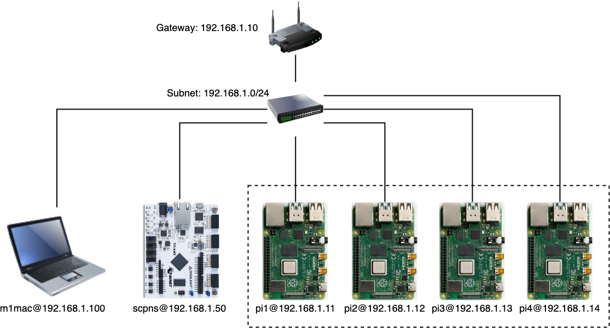

# FPGA RISC-V Softcore Processor for Network Security

**Bachelor of Engineering (Honours) Thesis Project**  
University of Queensland, 2024  
Lachlan Comino (s4532119)

[📄Full Thesis Report (PDF)](./Report/s4532119_thesis_report.pdf)

---

## Abstract

This thesis explores the implementation and evaluation of a network security processor using RISC-V softcores on FPGA hardware, with particular focus on hardware-accelerated AES encryption. Using the VexRiscvSMP processor and the Digilent Arty A7 FPGA platform, I developed and compared single-core, dual-core, and quad-core configurations to determine optimal performance characteristics for encrypting network traffic.

**Key Results:**
- **4x speedup** in raw AES operations using custom RISC-V instructions (compared to software implementation)
- **84% throughput improvement** with optimised dual-core design (406 KB/s) over baseline single-core (221 KB/s)
- Demonstrated feasibility of FPGA-based security processors for low-to-medium throughput applications
- Identified critical bottlenecks: ethernet throughput and memory access patterns in multi-core configurations

**Hardware comparison:** The FPGA implementation achieved 1/40th the throughput of a Raspberry Pi 4B, highlighting current limitations but demonstrating the viability of hardware-accelerated cryptography on resource-constrained platforms where power efficiency and hardware-level security are prioritised.

---

## Project Architecture

### Network Topology


The test environment consists of:
- **SCPNS** (Softcore Processor for Network Security): Arty A7 FPGA running VexRiscvSMP @ 100/150MHz
- **Client Cluster**: 4× Raspberry Pi 4B (1GB) generating encryption workloads
- **Development Workstation**: Test orchestration, metrics collection, TFTP server
- **Network**: Local 100Mbps ethernet switch

### System Overview


---

## Hardware Platform

**FPGA Board:** Digilent Arty A7-35T (Xilinx Artix-7 XC7A35T)

**Key Specifications:**
- 20,800 LUTs, 41,600 FFs, 50 BRAM blocks (1,800 Kb)
- 256MB DDR3 RAM (800-1200 MT/s)
- 16MB Quad-SPI Flash
- 100Mbps Ethernet PHY
- 90 DSP slices

**SoC Configuration:**
- **CPU:** VexRiscvSMP (RV32IMA ISA with custom AES instructions)
- **Memory:** 4KB L1 cache per core, 8KB shared L2 cache
- **Peripherals:** LiteEth MAC, LiteDRAM controller, Quad-SPI, UART, I2C, XADC
- **Interrupt Controllers:** SiFive PLIC/CLINT for SMP support
- **OS:** Buildroot Linux 6.9.0 with LibreSSL 3.2.2 (patched for hardware acceleration)

---

## Custom AES Hardware Acceleration

### Implementation Details

**Custom RISC-V Instructions** (implemented by [Charles Papon in VexRiscv](https://github.com/SpinalHDL/VexRiscv/tree/master/src/main/scala/vexriscv/plugin)):
- Utilises reserved `custom-0` opcode space (0x0B)
- Four instructions: `aes_enc_round`, `aes_enc_round_last`, `aes_dec_round`, `aes_dec_round_last`
- Combines SubBytes, ShiftRows, and MixColumns into single ROM lookup operations
- 512-word ROM organised in two banks for forward/inverse transformations

**Hardware Cost:**
- +824 LUTs, +194 FFs, +256 F7 Muxes
- +1.5% total utilisation
- +9mW power consumption (0.96% increase)

**Software Integration:**
- LibreSSL patch replaces software AES implementation
- Transparent acceleration for all TLS/SSL operations
- API-compatible with existing cryptographic software

**Performance:** 4.24 MB/s (AES-128-CBC) and 3.39 MB/s (AES-256-CBC) at 8KB blocks, representing a 4× improvement over software-only implementation.

---

## Key Performance Results

### Throughput Comparison (Large Scale Test: 100 Clients)


| Configuration | Throughput (KB/s) | Test Duration | Improvement |
|--------------|------------------|---------------|-------------|
| Single Core (100MHz) | 184.78 | 76 min | Baseline |
| Dual Core (100MHz) | 264.22 | 53 min | +43% |
| Quad Core (100MHz) | 245.57 | 57 min | +33% |
| **Dual Core (150MHz)** | **406.06** | **35 min** | **+84%** |
| Raspberry Pi 4B | 16,829.84 | <1 min | +9000% |

### Bottleneck Analysis

**Primary Bottleneck: Ethernet Throughput**
- IPerf3 TCP: 8.78 Mbps (single) → 21.6 Mbps (improved dual) vs. 323 Mbps (RPi)
- 100Mbps PHY with 8KB TX/RX buffers insufficient for multi-core scaling

**Secondary Bottleneck: Memory Contention**
- Quad-core shows diminishing returns due to shared DDR3 bus
- Stress-ng: IO operations degrade from dual (60,868 bogo ops) to quad (27,819)

**TLS Overhead:**
- Full TLS 1.3 stack reduces throughput to 12-20 KB/s
- Hardware AES acceleration shows minimal impact on end-to-end TLS performance
- Bottleneck shifted from cryptography to handshake/protocol overhead

### Resource Utilisation (Improved Dual Core @ 150MHz)

| Resource | Used | Available | Utilisation |
|----------|------|-----------|-------------|
| Slice LUTs | 18,680 | 20,800 | 89.81% |
| Flip-Flops | 11,836 | 41,600 | 28.45% |
| BRAM Tiles | 50 | 50 | 100.00% |
| DSP Slices | 8 | 90 | 8.89% |

**Power Consumption:**
- Total board power: 1.77W (including DDR3, PHY, peripherals)
- FPGA core: 0.944W (876mW dynamic, 68mW static)
- Operating temperature: 68-69°C (well within 0-85°C spec)

---

## My Contributions

### Hardware Design & Implementation
1. **Multi-core SoC Design:** Designed and synthesised single/dual/quad-core VexRiscvSMP configurations with full Linux support
2. **Memory Architecture:** Configured LiteDRAM controller, optimised cache hierarchies, analyzed timing constraints
3. **Peripheral Integration:** Integrated LiteEth MAC with expanded buffers (8KB→32KB), configured SPI flash, UART, I2C
4. **Clock Domain Optimisation:** Achieved stable 150MHz operation (50% increase) through timing constraint analysis and placement optimisation

### Software Stack Development
1. **Buildroot Linux Configuration:** Custom kernel config, device tree generation, cross-compilation toolchain setup
2. **LibreSSL Hardware Acceleration:** Integrated Charles Papon's AES instruction patch into LibreSSL 3.2.2 for transparent system-wide acceleration
3. **Multi-threaded Server Application:** Python-based encryption server with ThreadPoolExecutor (10 concurrent connections), 1MB chunked processing, optimised TCP parameters
4. **Distributed Test Framework:** 
   - Client orchestration across 4× Raspberry Pi nodes
   - Real-time metrics collection (CPU, memory, temperature, throughput)
   - SQLite database logging with HTTP endpoints
   - Automated test suite (4 scenarios, 100+ client simulations)

### Performance Analysis & Optimisation
1. **Comprehensive Benchmarking:** IPerf3, Stress-ng, OpenSSL speed tests, TLS 1.3 handshake analysis
2. **Bottleneck Identification:** Profiled ethernet, memory bus, and TLS stack limitations
3. **Design Space Exploration:** Evaluated 5 configurations to determine optimal core count vs. resource utilisation trade-offs
4. **Power/Thermal Analysis:** XADC monitoring, Vivado power estimation, thermal characterisation

---

## Project Structure

```
├── Report/                          # LaTeX thesis source & compiled PDF
│   ├── s4532119_thesis_report.pdf  # Full thesis document
│   ├── Chapter3/diagrams/          # Architecture diagrams
│   └── Chapter4/Results/           # Performance graphs & data
├── Project/
│   ├── cluster_network/            # Raspberry Pi client orchestration
│   │   └── docker-images/
│   │       ├── client/             # Python client implementation
│   │       ├── server/             # Python server implementation
│   │       └── tester.py           # Test orchestration framework
│   └── SCPNS/
│       ├── litex/                  # FPGA SoC generation scripts
│       │   └── soc_linux.py        # VexRiscvSMP configuration
│       ├── linux/                  # Buildroot overlay & applications
│       └── zephyr/                 # (Abandoned) Zephyr RTOS attempt
└── Poster/                         # Conference poster & demo materials
```

### Branch Organisation

**Note:** Branches contain configuration snapshots for quick switching between test scenarios. Not intended for reproduction outside my specific lab setup.

- `pi_vs_pis` - Raspberry Pi baseline benchmarks
- `kubernetes_with_board` - FPGA tests with/without custom AES instructions  
- `board_and_pis` - Combined FPGA + Pi cluster tests

**Better approach for future work:** Use a single branch with environment variables/config files to select configurations, or implement proper CI/CD with build matrices.

---

## Technology Stack & Dependencies

### Hardware Generation
- [**LiteX**](https://github.com/enjoy-digital/litex) - SoC builder framework (Python/Migen)
- [**VexRiscv**](https://github.com/SpinalHDL/VexRiscv) - RISC-V softcore CPU (SpinalHDL/Scala)
  - [VexRiscvSMP](https://github.com/SpinalHDL/VexRiscv/tree/master/src/main/scala/vexriscv/demo/smp) - Multi-core variant with cache coherency
  - [AES Plugin](https://github.com/SpinalHDL/VexRiscv/tree/master/src/main/scala/vexriscv/plugin) - Custom instruction implementation by Charles Papon
- [**LiteEth**](https://github.com/enjoy-digital/liteeth) - Ethernet MAC core
- [**LiteDRAM**](https://github.com/enjoy-digital/litedram) - DDR3 memory controller

### Software Platform
- [**Buildroot**](https://buildroot.org/) - Embedded Linux build system
- [**OpenSBI**](https://github.com/riscv/opensbi) - RISC-V supervisor binary interface
- [**LibreSSL**](https://www.libressl.org/) - Cryptographic library (patched for HW acceleration)
- **Linux Kernel 6.9.0** - Custom device tree for LiteX peripherals

### Development Tools
- **Xilinx Vivado 2023.1** - FPGA synthesis & place-and-route
- **openFPGALoader** - Open-source FPGA programming tool
- **GDB + OpenOCD** - RISC-V debugging over JTAG

### Benchmarking & Testing
- **IPerf3** - Network throughput measurement
- **Stress-ng** - Multi-core CPU/memory/IO stress testing
- **OpenSSL CLI** - Cryptographic performance benchmarks
- **Python 3.11** - Test orchestration, metrics collection (psutil, sqlite3, threading)

---

## Acknowledgments

- **Matthew D'Souza** - Thesis supervisor, equipment provision (Raspberry Pi cluster)
- **Charles Papon** - VexRiscv maintainer, AES custom instruction implementation
- **LiteX/Enjoy-Digital Community** - Open-source FPGA tooling ecosystem
- **RISC-V Foundation** - Open ISA specification and toolchain

---

## Key Findings & Future Work

### Conclusions
1. **Feasibility Demonstrated:** FPGA-based RISC-V security processors are viable for low-to-medium throughput applications (≤500 KB/s)
2. **Custom Instructions Effective:** 4× AES speedup achievable with minimal FPGA overhead (+1.5% resources)
3. **Scalability Limited:** Multi-core performance bottlenecked by 100Mbps ethernet and shared memory bus, not CPU capacity
4. **TLS Overhead Dominant:** Raw AES acceleration insufficient; handshake and protocol stack optimisations required

### Recommended Improvements
1. **Network Infrastructure:** Gigabit ethernet with DMA, hardware TCP/IP offload engine, multiple ethernet interfaces
2. **Memory Architecture:** Dual-port DDR3/DDR4, per-core L2 caches, AXI interconnect optimisation
3. **Additional Accelerators:** RSA/ECC for TLS handshakes, SHA-256/384 for HMAC, ChaCha20-Poly1305
4. **Power Management:** Clock gating, power domains, low-power co-microcontroller for FPGA wake/sleep

### Limitations & Caveats
- **No Physical Security:** PMP/privilege modes not evaluated, no side-channel protections
- **Hardcoded Keys:** Test implementation only; production requires secure key storage
- **Timing Violations:** 150MHz design has -2.8ns worst negative slack in DDR3 paths (stable in practice but not guaranteed)
- **Non-Reproducible Setup:** Code tightly coupled to lab network topology (192.168.1.x), specific SD card images, TFTP boot flow

---

## License

This project integrates multiple open-source components with various licenses:
- **LiteX/VexRiscv:** BSD-2-Clause
- **Linux Kernel:** GPL-2.0
- **OpenSBI:** BSD-2-Clause
- **LibreSSL:** ISC License + OpenSSL License

My original contributions (test framework, application code, thesis) are available under MIT License.

---

*This repository serves as a portfolio demonstration of FPGA design, embedded Linux development, and performance analysis skills. The code is not intended for production use or direct replication without significant modification.*