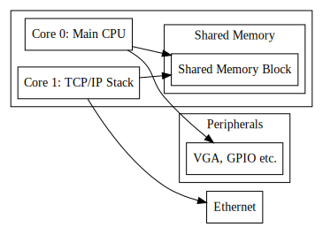
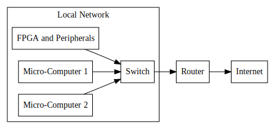
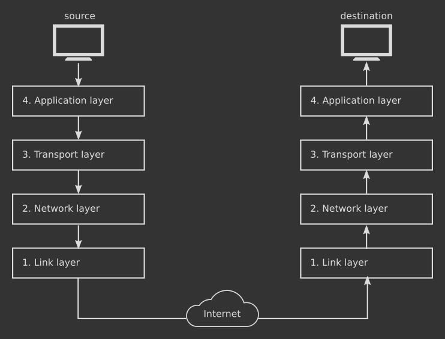

## Thesis Topic Description
### Embedded Systems Super Thesis Project: FPGA RISC-V Softcore Processor for Network Security

The RISC-V processor is an open source Soft Core processor. This project involves investigating how the RISC-V processor can be used for network security with zephyr RTOS for an embedded IOT application. The involves implementing a RISC-V processor with open source tools such as SCALA HDL and Chisel. The processor must be extended to include custom peripherals that can be added.

This project will use the Artyx S7 FPGA board. 

**Further Information**:  
[https://riscv.org/](https://riscv.org/)  
https://au.mouser.com/new/digilent/digilent-arty-s7-board/
https://risc-v-getting-started-guide.readthedocs.io/en/latest/zephyr-litex.html
https://www.chisel-lang.org/
## Topic Definition:

## Aims:
### Segmented TCP/IP stack across multiple cores:
High-level overview:

[[FPGA_Architecture_1 Code]]
### Network Overview

[[Network_Overview Code]]
#### TCP/IP stack example

## Background:
[[Thesis Sources List]]

## Literature Review:
